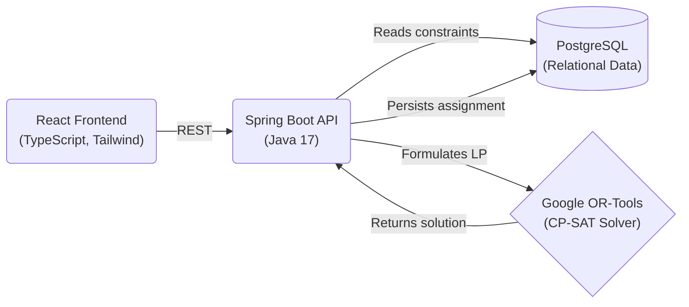

# WareOpt

**A warehouse labor scheduling and delivery slot optimization system using linear programming to minimize cost and distance under real-world operational constraints.**

> **Live Demo:** [https://wareopt-frontend.onrender.com](https://wareopt-frontend.onrender.com)
> *(Note: As this is deployed on Render's free tier, the backend may take up to 50 seconds to spin up on initial load)*

---

## 🏗 Architecture



---

## 🧮 The Optimization Math

### 1. Shift Assignment (Labor Cost Minimization)
**Objective:** Minimize total labor cost for the week.
$$\text{Minimize} \sum_{w \in W} \sum_{s \in S} (c_w \times x_{w,s})$$

**Subject to:**
- **Coverage Constraint:** Each shift must have exactly the required number of workers.
  $$\sum_{w \in W} x_{w,s} \geq \text{Required Workers}_s \quad \forall s \in S$$
- **Max Hours Constraint:** A worker cannot exceed their maximum allowed weekly hours.
  $$\sum_{s \in S} (\text{Duration}_s \times x_{w,s}) \leq \text{Max Hours}_w \quad \forall w \in W$$
- **Binary Assignment:** A worker is either assigned to a shift or not.
  $$x_{w,s} \in \{0, 1\}$$

### 2. Delivery Routing (Distance Minimization)
**Objective:** Minimize the total distance required to deliver all assigned orders.
$$\text{Minimize} \sum_{o \in O} \sum_{k \in K} (d_{o,k} \times y_{o,k})$$

**Subject to:**
- **Capacity Constraint:** The total weight of orders in a slot cannot exceed the vehicle's capacity.
  $$\sum_{o \in O} (\text{Weight}_o \times y_{o,k}) \leq \text{Max Capacity}_k \quad \forall k \in K$$
- **Exact Assignment Constraint:** Every order must be assigned to exactly one delivery slot.
  $$\sum_{k \in K} y_{o,k} = 1 \quad \forall o \in O$$
- **Deadline Constraint:** An order cannot be assigned to a slot that ends after the order's deadline.
  $$y_{o,k} = 0 \quad \text{if} \quad \text{End Time}_k > \text{Deadline}_o$$
- **Binary Assignment:**
  $$y_{o,k} \in \{0, 1\}$$

---

## 📸 Screenshots & Demo

*(Placeholder: Add your screen recording GIF here demonstrating the UI and solver)*
``

### Shift Dashboard
*(Placeholder: Add screenshot of the Shift Assignments view)*
``

### Delivery Routing
*(Placeholder: Add screenshot of the Delivery Slots scatter plot)*
``

---

## 🚀 How to Run Locally

The entire application stack is containerized and can be launched with zero manual configuration.

1. **Clone the repository:**
   ```bash
   git clone <your-repo-url>
   cd wareopt
   ```

2. **Run Docker Compose:**
   ```bash
   docker compose up --build -d
   ```
   *Note: On the first run, PostgreSQL will automatically execute the schema and seed scripts located in `db/` to populate the database with test data.*

3. **Access the Application:**
   - **Frontend Dashboard:** [http://localhost:3000](http://localhost:3000)
   - **Backend API Docs (Swagger):** [http://localhost:8080/swagger-ui.html](http://localhost:8080/swagger-ui.html)
   - **Database Connection:** `localhost:5432` (User: `wareopt_user`, Pass: `wareopt_password`)

---

## 🛠 Tech Stack

- **Frontend:** React, Vite, TypeScript, Tailwind CSS, Lucide Icons, Recharts
- **Backend:** Java 17, Spring Boot 3, Spring Data JPA, Google OR-Tools (CP-SAT)
- **Database:** PostgreSQL (with raw SQL migrations)
- **Infrastructure:** Docker, Docker Compose, Render (Live Hosting), GitHub Actions (CI/CD)

---

## 🧠 Design Decisions

* **Why Google OR-Tools (CP-SAT)?**
  While these problems can be modeled as pure Linear Programs (LPs), operational routing and scheduling often involve hard discrete logical constraints (like exactly one slot per order, or binary shift assignments). The CP-SAT (Constraint Programming - Boolean Satisfiability) solver handles integer and boolean constraints exceptionally well and is production-hardened at Google, making it the perfect choice for real-world warehouse logistics.
* **Why a normalized relational schema over a document store?**
  Optimization heavily relies on strict, predictable structural relationships (Worker -> Shift, Order -> Slot). A highly normalized relational schema ensures data integrity and prevents constraints (like an order missing a deadline or a worker exceeding hours) from ever being logically possible in the data layer prior to solving.
* **What constraints were modeled?**
  We strictly enforced operational realities: labor cost vs. maximum worker hours, and delivery distance vs. vehicle weight capacity & strict time-window deadlines. By coupling both solvers in a monolithic backend, it mirrors real operations where labor availability dictates fulfillment capabilities.
